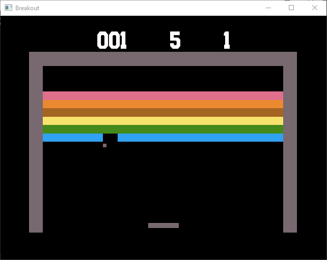

# BREAKOUT
### A clone of the Classic Game Breakout by gdinit
***This Software is in pre-release phase!***

Intro
--------------
This game is based on the Atari 2600 CX2622 variant and not the 
'Super Breakout CX2608.

Screenshots
--------------
Here is two!

 

Install
-------
There is a pre-release Windows binary available under releases.

Credits
-------
Please refer to "documentation/".

License
-------
See the additional LICENSE file, under "documentation/".
